# 🐣 GitHub Tamagotchi

A tiny pixel creature that lives on your GitHub profile and actually
reacts to your coding — it grows up, gets excited when you get a star,
and gets visibly sad if you disappear for two weeks. Think Tamagotchi,
but it's fed by your commits instead of button presses.

No app to install, no account to create, no server running anywhere.
Just a picture that updates itself.

<table>
<tr>
<td></td>
<td></td>
<td></td>
</tr>
<tr>
<td align="center"><sub>Sprout · idle</sub></td>
<td align="center"><sub>Byte · new star 🎉</sub></td>
<td align="center"><sub>Nova · evolving ✨</sub></td>
</tr>
</table>

<table>
<tr>
<td></td>
<td></td>
<td></td>
</tr>
<tr>
<td align="center"><sub>Cipher · misses you 😢</sub></td>
<td align="center"><sub>Byte · asleep 😴</sub></td>
<td align="center"><sub>✦ shiny — 1 in 64</sub></td>
</tr>
</table>

---

## Get one on your own profile in 3 steps

You don't need to know how to code for this part. Just copying and
pasting.

### 1. Add the workflow file to your own repo

Every GitHub account has a special repo — the one named exactly the
same as your username (e.g. `github.com/yourname/yourname`). Its
`README.md` is what shows up on your profile page. If you don't have one
yet, create a new repo with that exact name and tick "Add a README file."

Inside that repo, create a new file at this exact path:

```
.github/workflows/tamagotchi.yml
```

(On GitHub's website: **Add file → Create new file**, then type that
whole path into the name box — it'll make the folders for you.)

Paste this into it:

```yaml
name: Update GitHub Tamagotchi

on:
  schedule:
    - cron: "0 */6 * * *"   # refresh every 6 hours
  push:
    branches: [main]         # refresh right after you push commits
  workflow_dispatch: {}      # lets you trigger it manually too

permissions:
  contents: write

jobs:
  update-creature:
    runs-on: ubuntu-latest
    steps:
      - uses: actions/checkout@v4

      - name: Grow the creature
        uses: schoolbag-crypto/github-tamagotchi@v1
        with:
          github_token: ${{ secrets.GITHUB_TOKEN }}
          # username: your-github-username   # optional, defaults to repo owner
          # creature_name: Pixel             # optional, name your creature
```

Commit it.

### 2. Give it permission to save your creature's picture

By default GitHub doesn't let automated workflows save changes, for
safety. Turn it on for this one:

**Settings → Actions → General → Workflow permissions → "Read and write
permissions" → Save**

### 3. Show it off

Add this line anywhere in your `README.md`:

```markdown

```

Now go to **Actions** tab → **Update GitHub Tamagotchi** → **Run
workflow**, wait about 30 seconds, and refresh your profile page. Your
creature is alive. 🎉

From here it updates itself automatically — every 6 hours, and right
after you push code — with zero further effort from you.

---

## What it actually does, and why

Everything below exists to make it feel less like a stats badge and
more like a small pet you'd actually want to check on.

### 🥚 Evolution — Sprout → Byte → Cipher → Nova

Your creature isn't "level 3." It's a named form, and each one *looks*
different — Sprout is a round blob, Byte grows a tail and ears, Cipher
sprouts horns and wings, Nova gets a cape and crown. Evolution is based
on your contributions over the last 12 months, so it stays achievable
whether you're brand new or have been coding for a decade.

**Why:** leveling up should feel like a small story beat, not a progress
bar filling up.

### 😊 Moods — it has feelings, sort of

`idle → thinking → sleepy → sleeping → missing you → glitch`

The longer you go without committing, the sadder it gets — starting
gentle (a little drowsy) and ending dramatic (a flickering, "are you
still there?" glitch after 30+ days).

**Why:** one blunt "active/inactive" flag isn't very charming. A slow,
readable decay is.

### 🎉 Reactions — it notices things

New star on a repo, a new project, beating your own streak record,
leveling up, even its own little "adoption anniversary" once a year —
each one gets its own celebration animation.

**Why:** specific good moments deserve a specific reaction, not just a
generic "stats went up."

### 🎨 Personality traits

Based on your actual habits: **Night Owl** (codes late), **Pythonista** /
**Rustacean** / etc. (your most-used language), **Marathoner** (30+ day
streak), **Social Butterfly** (100+ stars), **Explorer** (20+ repos).
These also tint your creature's color.

**Why:** makes it feel like *your* creature, not a template.

### ❤️ Attachment — the part that's just for fun

- It remembers the day you "adopted" it, forever — shown as "together
  N days."
- A **bond meter** (♥1–5) grows every single time it checks in on you,
  regardless of whether you coded that day. Showing up matters on its
  own.
- You can **name it**.

**Why:** the whole point of a Tamagotchi is caring about it as a thing,
not just reading numbers off it.

### ✨ Easter eggs

- About **1 in 64 creatures is secretly shiny** — a permanent rare
  color, decided the moment you first run it, forever.
- Hit a "nice" number like 1337 or 2026 total contributions, get a badge.
- Real-world dates matter: expect a pumpkin in late October, a Santa hat
  in December, a party hat on New Year's.

**Why:** small surprises are worth checking back for.

---

## Configuration

Only the token is required — everything else is optional:

| Input | Default | What it does |
|---|---|---|
| `github_token` | — | Always `${{ secrets.GITHUB_TOKEN }}` |
| `username` | repo owner | Whose activity to track |
| `creature_name` | *(none)* | Give your creature a name |
| `output_path` | `.github-tamagotchi/creature.svg` | Where the picture is saved |
| `state_path` | `.github-tamagotchi/state.json` | Where its "memory" is saved |

---

## Troubleshooting

Real issues people hit, and the fix:

**Image shows a broken icon / 404 error:**
Check the Actions tab first — if there's no successful (green ✅) run,
the picture file was never created. Fix whatever's failing there before
worrying about the README link itself.

**Workflow fails on the "commit" step with something about `.gitignore`:**
If you're running this directly (not through the packaged Action), make
sure `.github-tamagotchi/` isn't listed in your `.gitignore` file — that
file is meant for local development only, not for a live profile setup.

**Workflow fails immediately, no useful error:**
Almost always missing permissions — double check **Settings → Actions →
General → Workflow permissions → Read and write permissions** is turned
on and saved.

**Nothing updates even though it worked once:**
It only refreshes every 6 hours by default (to save on Action minutes).
That's expected — it's not broken, just patient.

---

## For developers: running it locally / modifying it

```bash
npm install
npm test                 # run the unit tests
npm run examples         # regenerate example SVGs in /examples from mock data
GITHUB_TOKEN=ghp_xxx TAMAGOTCHI_USERNAME=octocat npm start   # run against real data
```

See [`docs/ARCHITECTURE.md`](docs/ARCHITECTURE.md) for how the whole
"animated image with no server" trick works, and how to add new moods,
traits, or evolution stages.

```
src/
  github/       Talks to GitHub's API (zero external dependencies)
  creature/     Evolution, streaks, traits, mood, bond — pure logic, fully unit tested
  render/       Pixel art, animation, and final image assembly
action.yml      The reusable GitHub Action definition
examples/       Sample creatures + the copy-paste workflow template
docs/           Architecture notes
```

## Limitations (on purpose)

- Reacts on a schedule (every 6 hours by default), not the literal instant
  something happens.
- One creature per person, not per repo — it's a pet, not a zoo.
- "Night owl" detection uses UTC time from recent activity, not your
  actual timezone.

## License

MIT — see [LICENSE](LICENSE). Use it, fork it, remix it.
